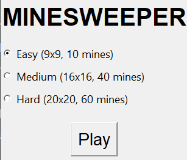
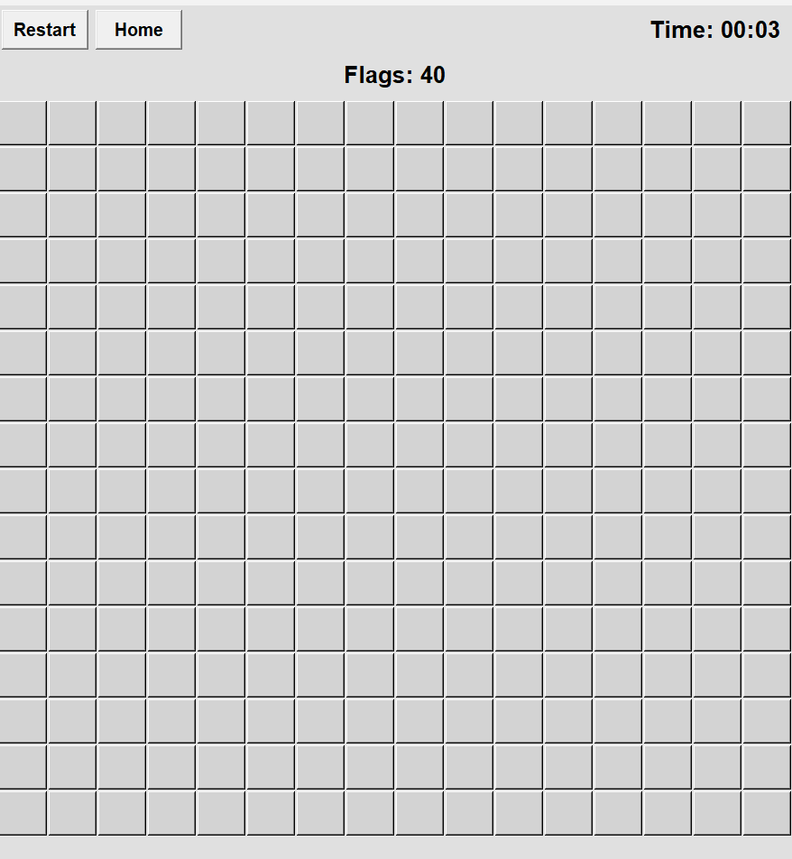

# Minesweeper in Python with Tkinter

A classic Minesweeper game built with Python and Tkinter.

## How to Run

1. Clone/download this repository.
2. Run `main.py` (requires Python 3).

## Features

- GUI with mouse interactions
- Flag counter
- 3 difficulty selections
- Timer
- Restart and Home buttons

## Screenshots

